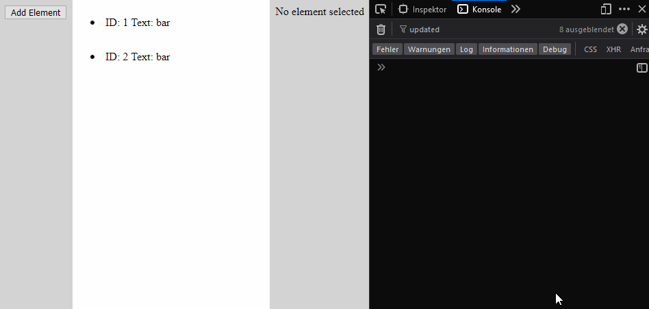

# Vue 3 Performance Experiment Inspired by Recoil

This Vue 3 app tries to mimic the behavior of [this app from the Youtube video by Jacques Blom](https://www.youtube.com/watch?v=9JVE8OGRSlA) implemented with React and [Recoil](https://recoiljs.org/), in a simplified way.

The app contains a dynamic number of elements in the main panel.
The button in the left panel allows you to add an element. Clicking on an element selects it. The panel on the right allows you to edit the state of the currently selected element.

## Performance

The goal of the implementation is to decouple the performance of the app from the number of elements. Specifically, an update to one element (changing selection, editing text) should only cause a **constant** number (`O(1)`) of component rerenders as opposed to a number that scales with the number of elements `O(n)`.  

This is achieved only using Vue 3's reactivity system.

## Demonstration



When changing the selection, only the components of the element that loses the selection and the element that gains the selection are rerendered.

When changing the text, only the component of the selected element is rerendered.

## Try it out

To run the app, clone the repo, then execute

```
yarn
yarn dev
```
